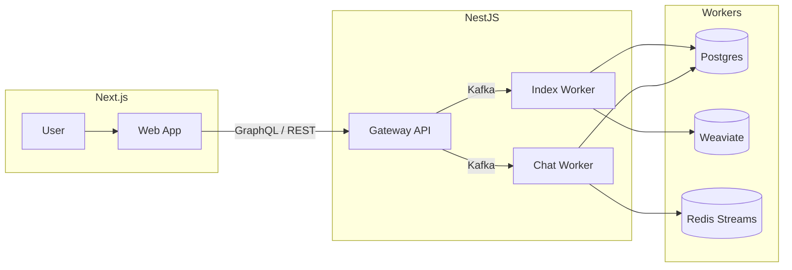
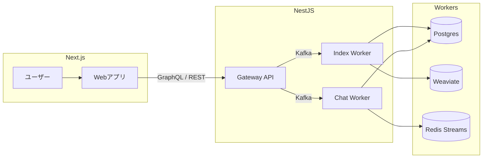

# 🥷 tweek.ninja — AI AGENT STARTER KIT FOR DUMMIES

> LLM 기반 RAG / AI Agent 포트폴리오 서비스  
> 현재도 계속 개발 및 개선 중이며, 구조는 **Gateway ↔ Worker ↔ Infra** 로 구성되어 있습니다.  
> 각 컴포넌트는 독립적인 서비스 단위로 동작합니다.

---

## 🏗️ 전체 아키텍처



---

## 🚀 주요 컴포넌트

| 구분 | 이름 | 설명 | 상태 |
|------|------|------|------|
| Web | `apps/web` | Next.js 기반 대시보드 / 관리자 UI | ⚙️ In Progress (code & docs) |
| Gateway | `apps/gateway` | GraphQL + REST API 게이트웨이 | ✅ Stable |
| Worker | `apps/workers/index_worker` | 인덱싱 파이프라인 (추출·청킹·임베딩·업서트) | ✅ Stable |
| Worker | `apps/workers/chat_worker` | 실시간 LLM 스트리밍 / SSE | ✅ Stable |
| Worker | `apps/workers/title_worker` | 세션 제목 자동 생성 | ⚙️ Exists — Pending Cleanup |
| Infra | `infra/docker` | Docker Compose / Redis / Kafka / PG / Weaviate | ✅ Stable |
| Docs | `docs/features/...` | 기능별 상세 문서 | 📝 Docs in Progress |

> 📄 문서 링크
> - [Chat Module](docs/features/gateway/chat.md)
> - [Ingest Module](docs/features/gateway/ingest.md)
> - [Chat Worker](docs/features/workers/chat.md)
> - [Index Worker](docs/features/workers/index.md)

---

## 📂 디렉터리 구조 (요약)

```
tweek.ninja/
 ├─ apps/
 │   ├─ gateway/            # NestJS GraphQL Gateway
 │   ├─ web/                # Next.js Web App
 │   └─ workers/
 │       ├─ index_worker/   # 문서 인덱싱 워커
 │       ├─ chat_worker/    # 채팅 응답 워커
 │       └─ title_worker/   # 자동 제목 워커 (WIP)
 │
 ├─ infra/
 │   ├─ docker/             # docker-compose.yml, env 설정
 │   ├─ scripts/            # 유틸 스크립트
 │
 ├─ docs/
 │   ├─ features/           # 기능별 개요문서
 │   ├─ architecture/       # 아키텍처 다이어그램 및 흐름도
 │
 ├─ ddl/                    # 데이터베이스 스키마
 └─ README.md
```

---

## 🧠 기술 스택

| 구분 | 주요 기술                                      |
|------|--------------------------------------------|
| LLM | OpenAI GPT-4o / LangChain / llama.cpp(예정)  |
| Server | FastAPI, NestJS, Redis Streams, Kafka      |
| Database | Postgres, Weaviate (Vector Store)          |
| Frontend | Next.js (App Router, SSR)                  |
| Infra | Docker Compose, Prometheus, Grafana, MinIO |

---

## 📈 진행 현황

- ✅ Gateway 완성 (Auth / Chat / Ingest / Session / File 모듈)
- ✅ Index Worker 완성 (청킹 / 임베딩 / 업서트 / 메트릭)
- ✅ Chat Worker 완성 (스트리밍 / 메트릭 / SSE / RAG 지원)
- ⚙️ Web (Next.js) 작성 중
- ⚙️ Title Worker 작성 중
- 📝 문서 (docs/features/*) 작성 중

---

## 🧩 TODO / 향후 계획

- [ ] 검색 품질 개선 (RAG 재순위화, 하이브리드 스코어링, 임베딩 신선도 추적)
- [ ] Worker 상태 모니터링 대시보드 추가 (Grafana / OpenTelemetry)
- [ ] Gateway - SSE 안정화 및 Rate Limit 정책 정립
- [ ] Web - 파일 벡터화 관리 UI 구축
- [ ] CI/CD 자동화 및 테스트 파이프라인 정비

---

# 🌐 English Summary

> **tweek.ninja — AI AGENT STARTER KIT FOR DUMMIES**  
> An evolving LLM‑based RAG / AI Agent portfolio project.  
> The architecture is organized into **Gateway ↔ Worker ↔ Infra**, each operating as an independent service.  
> Development and documentation are still ongoing.

---

## 🏗️ Architecture Overview


---

## 🚀 Components

| Type | Path | Description | Status |
|------|------|-------------|---------|
| Web | `apps/web` | Next.js dashboard / admin UI | ⚙️ In Progress (code & docs) |
| Gateway | `apps/gateway` | GraphQL + REST API gateway | ✅ Stable |
| Worker | `apps/workers/index_worker` | Indexing pipeline (extract, chunk, embed, upsert) | ✅ Stable |
| Worker | `apps/workers/chat_worker` | Real‑time LLM streaming / SSE | ✅ Stable |
| Worker | `apps/workers/title_worker` | Auto‑title generator | ⚙️ Exists — Pending Cleanup |
| Infra | `infra/docker` | Docker Compose / Redis / Kafka / PG / Weaviate | ✅ Stable |
| Docs | `docs/features/...` | Feature documentation | 📝 Docs in Progress |


> 📄 Documentation Links
> - [Chat Module](docs/features/gateway/chat.md)
> - [Ingest Module](docs/features/gateway/ingest.md)
> - [Chat Worker](docs/features/workers/chat.md)
> - [Index Worker](docs/features/workers/index.md)

---

## 🧠 Tech Stack

| Category | Stack |
|-----------|--------|
| LLM | OpenAI GPT‑4o / LangChain / llama.cpp *(planned)* |
| Server | FastAPI, NestJS, Redis Streams, Kafka |
| Database | Postgres, Weaviate (Vector Store) |
| Frontend | Next.js (App Router, SSR) |
| Infra | Docker Compose, Prometheus, Grafana, MinIO |

---

## 📈 Progress

- ✅ Gateway implemented (Auth / Chat / Ingest / Session / File modules)  
- ✅ Index Worker implemented (Chunking / Embedding / Upsert / Metrics)  
- ✅ Chat Worker implemented (Streaming / Metrics / SSE / RAG support)  
- ⚙️ Web (Next.js) under development  
- ⚙️ Title Worker under development  
- 📝 Docs (docs/features/*) in progress  

---


## 🧩 TODO / Next Steps

- [ ] Improve RAG search quality (re‑ranking, hybrid scoring, embedding freshness)  
- [ ] Add worker monitoring dashboards (Grafana / OpenTelemetry)  
- [ ] Gateway: SSE stability & rate‑limit policy  
- [ ] Web: file vectorization management UI  
- [ ] CI/CD automation and test pipelines  

---

# 🇯🇵 日本語サマリー

> **🥷 tweek.ninja — バカたちのためのAIエージェントスターターキット**  
> LLMベースのRAG / AIエージェントポートフォリオプロジェクトです。  
> 現在も開発・改良を続けており、構成は **Gateway ↔ Worker ↔ Infra** の3層構造になっています。  
> それぞれのコンポーネントは独立したサービスとして動作します。

---

## 🏗️ アーキテクチャ概要



---

## 🚀 コンポーネント

| 種別 | パス | 説明 | 状態 |
|------|------|------|------|
| Web | `apps/web` | Next.jsベースのダッシュボード / 管理UI | ⚙️ 開発中 (コード & ドキュメント) |
| Gateway | `apps/gateway` | GraphQL + REST APIゲートウェイ | ✅ 安定版 |
| Worker | `apps/workers/index_worker` | インデクシングパイプライン（抽出・分割・埋め込み・アップサート） | ✅ 安定版 |
| Worker | `apps/workers/chat_worker` | リアルタイムLLMストリーミング / SSE | ✅ 安定版 |
| Worker | `apps/workers/title_worker` | セッションタイトル自動生成 | ⚙️ 存在 — 整理予定 |
| Infra | `infra/docker` | Docker Compose / Redis / Kafka / PG / Weaviate | ✅ 安定版 |
| Docs | `docs/features/...` | 機能別ドキュメント | 📝 執筆中 |


> 📄 ドキュメントリンク
> - [Chat Module](docs/features/gateway/chat.md)
> - [Ingest Module](docs/features/gateway/ingest.md)
> - [Chat Worker](docs/features/workers/chat.md)
> - [Index Worker](docs/features/workers/index.md)
---

## 🧠 技術スタック

| カテゴリ | スタック |
|-----------|-----------|
| LLM | OpenAI GPT-4o / LangChain / llama.cpp *(予定)* |
| サーバー | FastAPI, NestJS, Redis Streams, Kafka |
| データベース | Postgres, Weaviate (ベクトルストア) |
| フロントエンド | Next.js (App Router, SSR) |
| インフラ | Docker Compose, Prometheus, Grafana, MinIO |

---

## 📈 進捗状況

- ✅ Gateway 完了 (Auth / Chat / Ingest / Session / File モジュール)
- ✅ Index Worker 完了 (分割 / 埋め込み / アップサート / メトリクス)
- ✅ Chat Worker 完了 (ストリーミング / メトリクス / SSE / RAG対応)
- ⚙️ Web (Next.js) 開発中
- ⚙️ Title Worker 開発中
- 📝 ドキュメント (docs/features/*) 執筆中

---

## 🧩 TODO / 今後の計画

- [ ] 検索品質の向上（RAG再ランキング、ハイブリッドスコアリング、埋め込みの鮮度追跡）  
- [ ] Worker監視ダッシュボードの追加（Grafana / OpenTelemetry）  
- [ ] Gateway：SSE安定化とRate Limitポリシーの整備  
- [ ] Web：ファイルベクトル化管理UIの構築  
- [ ] CI/CD自動化とテストパイプラインの整備  
