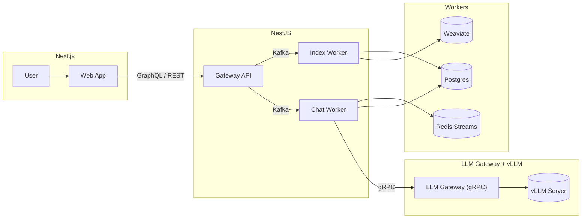
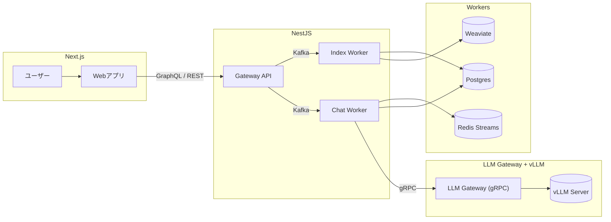

# Talkie🤔 — AI AGENT STARTER KIT FOR DUMMIES

> LLM 기반 RAG / AI Agent 프로젝트  
> 현재도 활발히 개발 중이며, 구조는 **Gateway ↔ Worker ↔ Infra** 로 분리되어 각각 독립적인 서비스 단위로 운영됩니다.

---

## 🎯 Chat Worker & RAG 하이라이트

- Kafka `chat.request` 토픽을 소비하며, **GEN(대화)** 과 **RAG(검색 기반 답변)** 모드를 모두 지원합니다.
- 아키텍처는 Kafka 아웃박스 패턴, 콜백 기반 처리, SSE 스트리밍 플로우로 구성되어,  
  vLLM Gateway에서 토큰을 받아 Redis Streams에 퍼블리시 → Gateway/Web UI로 실시간 전송됩니다.
- vLLM 기반 Go 언어 구현 gRPC 서버인 **LLM Gateway**를 별도 서비스로 운영하여,  
  모델 로딩과 추론을 워커에서 분리함으로써 확장성과 성능을 크게 향상시켰습니다.
- **Weaviate v4** 와 하이브리드 검색(BM25 + 벡터), 한국어/일본어 친화적 쿼리 정규화를 적용한 RAG를 구현합니다.
- Postgres에 대화 내역과 메트릭을 저장하며, SSE를 통해 실시간 응답이 Gateway와 Web에 전달됩니다.

> 상세 구현은 `docs/features/workers/chat.md` 와 `apps/workers/chat_worker/*` 에서 확인하세요.

---

## 🏗️ 전체 아키텍처



---

## 🚀 주요 컴포넌트

| 구분        | 이름                        | 설명                                                                        | 상태                        |
| ----------- | --------------------------- | --------------------------------------------------------------------------- | --------------------------- |
| Web         | `apps/web`                  | Next.js 기반 Web UI                                                         | ✅ Stable                   |
| Gateway     | `apps/gateway`              | GraphQL + REST API 게이트웨이                                               | ✅ Stable                   |
| Worker      | `apps/workers/index_worker` | 추출 → 청킹 → 임베딩 → 업서트 파이프라인, Weaviate v4 스키마 자동 관리 포함 | ✅ Stable                   |
| Worker      | `apps/workers/chat_worker`  | Kafka 아웃박스, 콜백, SSE 기반 실시간 LLM 스트리밍 처리                     | ✅ Stable                   |
| LLM Gateway | `apps/llm-gateway`          | Go 기반 gRPC vLLM 서버, 모델 로딩과 추론 분리로 확장성·성능 향상            | ✅ Stable                   |
| Infra       | `infra/docker`              | Docker Compose, Redis, Kafka, Postgres, Weaviate 구성                       | ✅ Stable                   |
| Docs        | `docs/features/...`         | 기능별 상세 문서                                                            | 📝 작성 중                  |

> 📄 문서 링크
>
> - [Chat Module](docs/features/gateway/chat.md)
> - [Ingest Module](docs/features/gateway/ingest.md)
> - [Chat Worker](docs/features/workers/chat.md)
> - [Index Worker](docs/features/workers/index.md)
> - [LLM Gateway](docs/features/llm-gateway.md)

---

## 📂 디렉터리 구조 (요약)

```
talkie/
 ├─ apps/
 │   ├─ gateway/            # NestJS GraphQL Gateway
 │   ├─ web/                # Next.js Web App
 │   ├─ llm-gateway/        # Go-based gRPC LLM Gateway
 │   └─ workers/
 │       ├─ index_worker/   # 문서 인덱싱 파이프라인
 │       └─ chat_worker/    # 실시간 LLM 스트리밍 워커
 │
 ├─ infra/
 │   ├─ docker/             # docker-compose.yml, 환경설정
 │   ├─ scripts/            # 유틸리티 스크립트
 │
 ├─ docs/
 │   ├─ features/           # 기능별 문서
 │   ├─ architecture/       # 아키텍처 다이어그램 및 흐름도
 │
 ├─ ddl/                    # 데이터베이스 스키마
 └─ README.md
```

---

## 🧠 기술 스택

| 구분     | 주요 기술                                                                   |
| -------- | --------------------------------------------------------------------------- |
| LLM      | vLLM + Go 기반 LLM Gateway(gRPC), OpenAI GPT-4o (임베딩 및 폴백), LangChain |
| Server   | NestJS, Redis Streams, Kafka                                                |
| Database | Postgres, Weaviate (Vector Store)                                           |
| Frontend | Next.js (App Router, SSR)                                                   |
| Infra    | Docker Compose, Prometheus, Grafana, MinIO                                  |

---

## 📈 진행 현황

- ✅ Gateway (Auth / Chat / Ingest / Session / File 모듈 완성)
- ✅ Index Worker (추출 → 청킹 → 임베딩 → 업서트, 메트릭 수집 및 Weaviate 스키마 자동화)
- ✅ Chat Worker (Kafka 아웃박스, 콜백, SSE, vLLM 토큰 스트리밍 파이프라인 완성)
- ✅ Web (기본 구조, 인증, 세션, 채팅 UI 등 완성)
- ✅ RAG 체인 단순화 및 LLM 폴백 관련 문서화
- ✅ LLM 추론 및 서비스 메트릭 수집 체계 구축
- ✅ Title Worker 완전 통합 (Chat Worker 내부 서비스 구조로 정리 완료)
- 📝 문서 (docs/features/\*) 작성 중

---

## 🧩 TODO / 향후 계획

- [ ] 검색 품질 개선 (RAG 재순위화, 하이브리드 스코어링, 임베딩 신선도 추적)
- [ ] Worker 상태 모니터링 대시보드 추가 (Grafana / OpenTelemetry)
- [ ] Gateway SSE 안정화 및 Rate Limit 정책 수립
- [ ] CI/CD 자동화 및 테스트 파이프라인 정비

---

## ⚙️ 로컬 개발 / 실행 방법 (요약)

1. 의존성 설치
   - Node: `pnpm install`
   - Python: `python -m venv .venv && . .venv/bin/activate && pip install -r requirements.txt`
2. 인프라 컨테이너 실행 (Kafka / Redis / Postgres / Weaviate 등)
   - `make docker-up`
3. Web / Gateway 서버 실행
   - Web: `make web` (`apps/web`)
   - Gateway: `make gateway` (`apps/gateway`)
4. LLM Gateway 실행
   - 환경 변수 설정: `.env` 또는 `.env.local`에 `MODEL_PATH`, `GRPC_PORT`, `MAX_TOKENS` 등 필수 값 작성
   - `make llm-gateway` (`apps/llm-gateway`에서 Go 기반 gRPC 서버 실행)
5. Chat Worker 실행
   - `apps/workers/chat_worker/.env.local` 에 필수 환경 변수 작성 (예: `OPENAI_API_KEY`, `DB_URL`, `WEAVIATE_URL`, `KAFKA_BOOTSTRAP`, `REDIS_URL`, `RAG_TOP_K` 등)
   - `. .venv/bin/activate && make worker-chat`
6. 종료
   - `make docker-down`

> 각 컴포넌트의 상세 설정은 `apps/workers/chat_worker/settings.py`, `infra/docker/docker-compose.dev.yml` 등을 참고하세요.

---

# 🌐 English Summary

> **Talkie🤔 — AI AGENT STARTER KIT FOR DUMMIES**  
> An evolving LLM-based RAG / AI Agent portfolio project.  
> The architecture is cleanly separated into **Gateway ↔ Worker ↔ Infra**, each running as independent services.

---

## 🎯 Chat Worker & RAG Highlights

- Consumes Kafka topic `chat.request`, supporting both **GEN (history-aware chat)** and **RAG (retrieval-augmented generation)** modes.
- Implements a Kafka outbox pattern with callback-driven processing and SSE streaming. Tokens from the vLLM Gateway flow into Redis Streams, then to Gateway/UI in real time.
- The **LLM Gateway** is a Go-based gRPC server that separates model loading and inference from workers, boosting scalability and performance.
- Uses **Weaviate v4** with hybrid search (BM25 + vector) and Korean/Japanese-aware query normalization for RAG.
- Chat history and metrics are persisted in Postgres; Gateway and Web consume Redis Streams for live responses.

> See `docs/features/workers/chat.md` and `apps/workers/chat_worker/*` for details.

---

## 🏗️ Architecture Overview


---

## 🚀 Components

| Type        | Path                        | Description                                                                                       | Status                      |
| ----------- | --------------------------- | ------------------------------------------------------------------------------------------------- | --------------------------- |
| Web         | `apps/web`                  | Next.js-based Web UI                                                                              | ✅ Stable                   |
| Gateway     | `apps/gateway`              | GraphQL + REST API gateway                                                                        | ✅ Stable                   |
| Worker      | `apps/workers/index_worker` | Extraction → chunking → embedding → upsert pipeline with Weaviate v4 schema auto-management       | ✅ Stable                   |
| Worker      | `apps/workers/chat_worker`  | Kafka outbox, callback, SSE-based real-time LLM streaming                                         | ✅ Stable                   |
| LLM Gateway | `apps/llm-gateway`          | Go-based gRPC vLLM server with model loading/inference separation for scalability and performance | ✅ Stable                   |
| Infra       | `infra/docker`              | Docker Compose, Redis, Kafka, Postgres, Weaviate                                                  | ✅ Stable                   |
| Docs        | `docs/features/...`         | Feature documentation                                                                             | 📝 Docs in Progress         |

> 📄 Documentation Links
>
> - [Chat Module](docs/features/gateway/chat.md)
> - [Ingest Module](docs/features/gateway/ingest.md)
> - [Chat Worker](docs/features/workers/chat.md)
> - [Index Worker](docs/features/workers/index.md)
> - [LLM Gateway](docs/features/llm-gateway.md)

---

## 🧠 Tech Stack

| Category | Stack                                                                          |
| -------- | ------------------------------------------------------------------------------ |
| LLM      | vLLM + Go LLM Gateway (gRPC), OpenAI GPT-4o (embeddings & fallback), LangChain |
| Server   | NestJS, Redis Streams, Kafka                                                   |
| Database | Postgres, Weaviate (Vector Store)                                              |
| Frontend | Next.js (App Router, SSR)                                                      |
| Infra    | Docker Compose, Prometheus, Grafana, MinIO                                     |

---

## 📈 Progress

- ✅ Gateway implemented (Auth / Chat / Ingest / Session / File modules)
- ✅ Index Worker implemented (Extraction → chunking → embedding → upsert with metrics and Weaviate schema auto-management)
- ✅ Chat Worker implemented (Kafka outbox, callback, SSE, vLLM token streaming pipeline)
- ✅ Web (base structure, authentication, sessions, chat UI)
- ✅ Title Worker fully integrated (merged into Chat Worker service architecture)
- 📝 Docs (docs/features/\*) in progress

---

# 🇯🇵 日本語サマリー

> **🥷 Talkie🤔 — バカたちのためのAIエージェントスターターキット**  
> LLMベースのRAG / AIエージェントポートフォリオプロジェクト。  
> 構成は **Gateway ↔ Worker ↔ Infra** の3層に分かれ、それぞれ独立サービスとして運用されています。

---

## 🎯 Chat Worker / RAG ハイライト

- Kafka トピック `chat.request` を購読し、**GEN（履歴考慮チャット）** と **RAG（検索拡張応答）** の両方をサポート。
- Kafka アウトボックス、コールバック処理、SSE ストリーミングで構成され、  
  vLLM Gateway から受け取ったトークンを Redis Streams にパブリッシュし、Gateway / Web UI へリアルタイム配信します。
- Go 言語で実装された gRPC サーバー **LLM Gateway** を独立サービスとして運用し、モデルロードと推論をワーカーから分離することで拡張性と性能を大幅に向上。
- **Weaviate v4** とハイブリッド検索（BM25 + ベクトル）、日本語・韓国語に最適化したクエリ正規化を用いた RAG を実装。
- Postgres に会話履歴とメトリクスを保存し、SSE を通じて Gateway / Web へリアルタイム応答を提供。

> 詳細な実装は `docs/features/workers/chat.md` および `apps/workers/chat_worker/*` を参照してください。

---

## 🏗️ アーキテクチャ概要



---

## 🚀 コンポーネント

| 種別        | パス                        | 説明                                                                                         | 状態                         |
| ----------- | --------------------------- | -------------------------------------------------------------------------------------------- | ---------------------------- |
| Web         | `apps/web`                  | Next.jsベースのWeb UI                                                                        | ✅ Stable                    |
| Gateway     | `apps/gateway`              | GraphQL + REST APIゲートウェイ                                                               | ✅ Stable                    |
| Worker      | `apps/workers/index_worker` | 抽出 → チャンク化 → 埋め込み → アップサート パイプライン、Weaviate v4 スキーマ自動管理を含む | ✅ Stable                    |
| Worker      | `apps/workers/chat_worker`  | Kafka アウトボックス、コールバック、SSE ベースのリアルタイム LLM ストリーミング処理          | ✅ Stable                    |
| LLM Gateway | `apps/llm-gateway`          | Go ベースの gRPC vLLM サーバー、モデルロードと推論を分離して拡張性・性能を向上               | ✅ Stable                    |
| Infra       | `infra/docker`              | Docker Compose, Redis, Kafka, Postgres, Weaviate                                             | ✅ Stable                    |
| Docs        | `docs/features/...`         | 機能別ドキュメント                                                                           | 📝 執筆中                    |

> 📄 ドキュメントリンク
>
> - [Chat Module](docs/features/gateway/chat.md)
> - [Ingest Module](docs/features/gateway/ingest.md)
> - [Chat Worker](docs/features/workers/chat.md)
> - [Index Worker](docs/features/workers/index.md)
> - [LLM Gateway](docs/features/llm-gateway.md)

---

## 🧠 技術スタック

| カテゴリ       | スタック                                                                            |
| -------------- | ----------------------------------------------------------------------------------- |
| LLM            | vLLM + Go LLM Gateway(gRPC) / OpenAI GPT-4o（埋め込み・フォールバック） / LangChain |
| サーバー       | NestJS, Redis Streams, Kafka                                                        |
| データベース   | Postgres, Weaviate (ベクトルストア)                                                 |
| フロントエンド | Next.js (App Router, SSR)                                                           |
| インフラ       | Docker Compose, Prometheus, Grafana, MinIO                                          |

---

## 📈 進捗状況

- ✅ Gateway（Auth / Chat / Ingest / Session / File モジュール完了）
- ✅ Index Worker（抽出 → チャンク化 → 埋め込み → アップサート、メトリクス収集・Weaviateスキーマ自動化）
- ✅ Chat Worker（Kafka Outbox・コールバック・SSE・vLLMトークンストリーミングパイプライン 完成）
- ✅ Web（基本構造・認証・セッション・チャットUI 完成）
- ✅ Title Worker を完全統合（Chat Worker のサービスアーキテクチャへ統合済み）
- 📝 ドキュメント（docs/features/\*）執筆中
