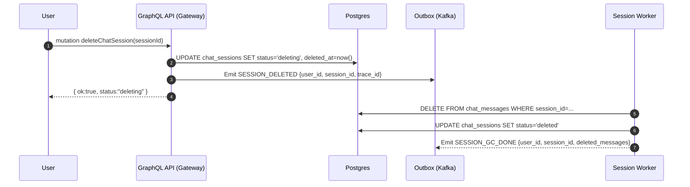
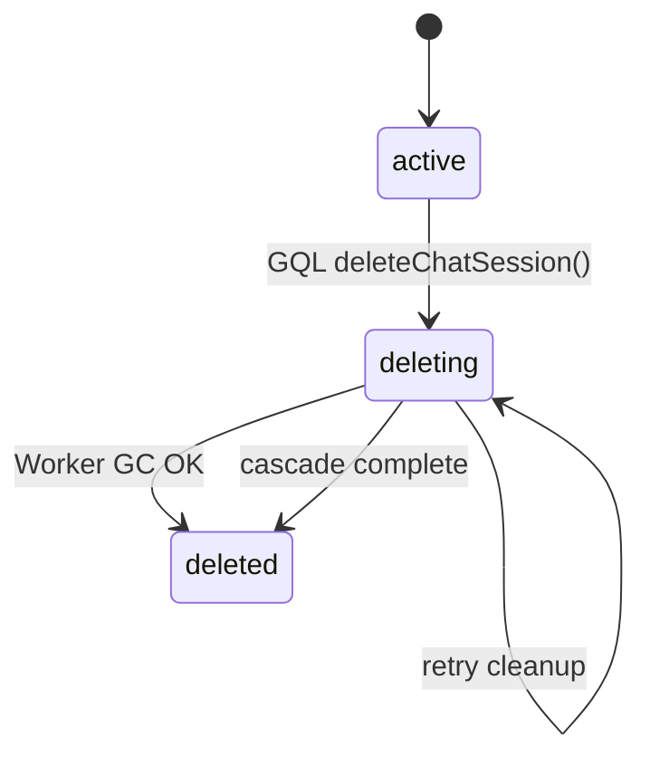

# Chat Session Deletion Flow (Async, Cascade-safe)

> Version: 2025-10-28 • Owner: Chat/Gateway + Session Worker • Status: Draft → Adopted (MVP)

This document defines how we **delete or soft-delete chat sessions** and their **associated chat messages** in a way that ensures **RAG safety**, **auditability**, and **predictable user experience**.  
The goal is to provide a **fast UI acknowledgment (soft delete)** while maintaining **eventual consistency** in background cleanup.

---

## 1) Goals

- Users can delete an entire **chat session** (including all its messages).  
- The UI should respond immediately (soft delete).  
- Background workers (or cascade delete) ensure data is fully removed from the DB.  
- RAG or history queries must **never expose deleted sessions**.

### Non-Goals

- Partial message deletion within a session.  
- Bulk account wipe.  
- Physical DB vacuuming or TTL-based retention.

---

## 2) System Context

- **Gateway (GraphQL)** ← user mutation entrypoint  
- **Postgres** (source of truth; `chat_sessions`, `chat_messages`)  
- **Kafka** (outbox → background workers)  
- **Session Worker** (optional async cleanup if we choose soft delete)  
- **Redis / SSE Stream** (should not emit from deleted sessions)

---

## 3) High-level Sequence (Soft Delete Path)



> **Cascade Alternative:**  
> If `ON DELETE CASCADE` is active for `chat_messages.session_id`, the worker can skip manual deletion and simply mark the session as deleted after confirmation.

---

## 4) Decision: Soft Delete vs Hard Delete

| Mode | Pros | Cons | Use Case |
|------|------|------|----------|
| **Soft Delete (`status=deleting/deleted`)** | Safe rollback, audit trail, consistent with file deletion flow | Requires background cleanup, extra column filters | Default mode (MVP) |
| **Hard Delete (Cascade)** | Simpler DB logic, no worker overhead | No audit trace, irrecoverable | Internal ops purge, DLQ recovery |

> For MVP we adopt **Soft Delete** to keep UX consistent with file deletion.  
> Hard delete may be introduced later for maintenance or full user account removal.

---

## 5) GraphQL API (Gateway)

```graphql
type DeleteChatSessionResult {
  ok: Boolean!
  status: String!
  sessionId: ID!
}

type Mutation {
  deleteChatSession(sessionId: ID!): DeleteChatSessionResult!
}
```

### Resolver (NestJS / Apollo style)
```ts
async function deleteChatSession(_root, { sessionId }, ctx) {
  const userId = ctx.auth.userId;

  await db.tx(async t => {
    const s = await t.oneOrNone(
      `SELECT status FROM chat_sessions WHERE id=$1 AND user_id=$2 FOR UPDATE`,
      [sessionId, userId]
    );
    if (!s) throw new NotFoundError();

    if (s.status !== 'deleted') {
      await t.none(`
        UPDATE chat_sessions
           SET status='deleting', deleted_at=now()
         WHERE id=$1 AND user_id=$2`,
        [sessionId, userId]
      );
      await t.none(`
        INSERT INTO outbox(topic, key, payload)
        VALUES ($1, $2, $3)`,
        ['SESSION_DELETED', sessionId, JSON.stringify({ user_id: userId, session_id: sessionId })]
      );
    }
  });

  return { ok: true, status: 'deleting', sessionId };
}
```

---

## 6) Outbox / Kafka Topics

| Topic | Key | Payload | Notes |
|--------|------|----------|------|
| `SESSION_DELETED` | `session_id` | `{ user_id, session_id, trace_id }` | Issued on user mutation |
| `SESSION_GC_DONE` | `session_id` | `{ user_id, session_id, deleted_messages }` | Cleanup complete |
| `SESSION_GC_FAIL` | `session_id` | `{ user_id, session_id, error, retry_in_ms }` | Worker retry backoff |

---

## 7) Data Model Touchpoints

| Table | Relevant Columns | Notes |
|--------|------------------|-------|
| `chat_sessions` | id, user_id, status, deleted_at | source of truth |
| `chat_messages` | id, session_id (FK, cascade), content | auto-deleted or manually cleaned |
| `outbox` | topic, key, payload, created_at | used for event dispatch |

**RAG guards:**  
Retrievers or history APIs must exclude sessions where `status != 'active'`.

---

## 8) State Machine



---

## 9) Failure Handling

- **Worker retries** with exponential backoff.  
- If cascade delete is automatic, no worker required; DB handles atomic removal.  
- DLQ (`SESSION_GC_FAIL`) remains visible for ops monitoring.

---

## 10) Observability

- Prometheus Metrics  
  - `chat_session_gc_total{result="ok|fail"}`
  - `chat_session_deleted_messages_sum`
  - `outbox_publish_total{topic="SESSION_DELETED|SESSION_GC_DONE"}`

- Logs must include `trace_id`, `user_id`, and `session_id`.  
- Grafana panel for "Deleted Sessions Count" vs "Pending Cleanup".

---

## 11) Security & Privacy

- **AuthZ:** Only session owner can delete.  
- **Cascade delete** ensures no orphan messages remain.  
- **Audit trail:** keep `deleted_at` timestamp for compliance.

---

## 12) Local / Dev Checklist

- [ ] Create a session → send several messages.  
- [ ] Call `deleteChatSession` → expect `{status:"deleting"}`.  
- [ ] Verify messages disappear (cascade or worker cleanup).  
- [ ] Confirm RAG queries no longer reference session context.  
- [ ] Retry path: simulate worker crash → DLQ → retry → success.

---

## 13) Rollback Strategy

- Soft delete prevents accidental data loss; `status` can be reverted to `active` if needed.  
- Hard delete is irreversible once committed.  
- For recovery testing, `undeleteChatSession` mutation can be implemented internally.
