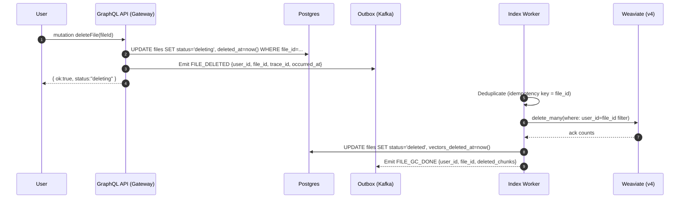
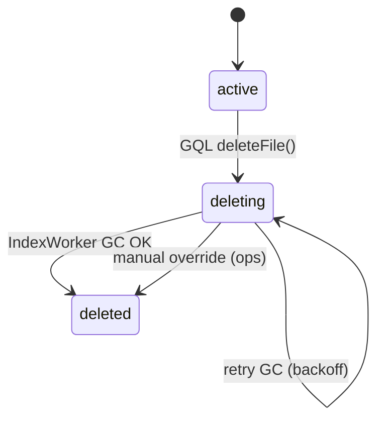

# File Deletion Flow (Async, RAG‑safe)

> Version: 2025‑10‑28 • Owner: Chat/Gateway + Index Worker • Status: Draft → Adopted (MVP)

This document defines how we **soft‑delete files** and **asynchronously garbage‑collect vector data** (Weaviate) while keeping user‑visible history consistent and metrics intact. The goal is **eventually consistent but user‑predictable** deletion with robust retries and observability.

---

## 1) Goals

- Users can request deletion of an uploaded file (single file granularity).
- UI gets an **immediate success** (soft delete) while background workers remove derived artifacts:
  - Weaviate vector chunks (`user_id`, `file_id` filter)
  - Indexing job artifacts / caches (if any)
- **RAG results never surface deleted content** after soft delete.
- Idempotent, safe to retry; resumable after failures/restarts.

### Non‑Goals

- Bulk account wipe (out of scope here).
- Per‑chunk selective deletion (we delete per file).
- Physical DB vacuuming policy.

---

## 2) System Context

- **Gateway (GraphQL)** ← user action entrypoint  
- **Postgres** (source of truth; `files`, `chat_messages`, …)  
- **Kafka** (outbox → background workers)  
- **Index Worker** (consumes events; operates Weaviate v4)  
- **Weaviate** (vector store; collection with custom schema; no auto‑vectorizer)

---

## 3) High‑level Sequence



> **RAG safety:** Queries MUST honor `files.status != 'deleted'` (or join via `file_id`) starting from the soft‑delete moment, so deleted content cannot resurface even if vectors linger briefly.

---

## 4) Contract Details

### 4.1 GraphQL API (Gateway)

**Schema (SDL):**
```graphql
type DeleteFileResult {
  ok: Boolean!
  status: String! # "deleting" | "deleted" (rarely if synchronous, but we return "deleting")
  fileId: ID!
}

type Mutation {
  deleteFile(fileId: ID!): DeleteFileResult!
}
```

**Resolver (outline):**
```ts
// Pseudocode (NestJS/Apollo style)
async function deleteFile(_root, { fileId }, ctx): Promise<DeleteFileResult> {
  const userId = ctx.auth.userId;

  // 1) Soft delete + guard against repeats
  await db.tx(async t => {
    const f = await t.oneOrNone(
      `SELECT status FROM files WHERE file_id=$1 AND user_id=$2 FOR UPDATE`,
      [fileId, userId]
    );
    if (!f) throw new NotFoundError();

    if (f.status !== 'deleted') {
      await t.none(
        `UPDATE files
           SET status='deleting', deleted_at=now()
         WHERE file_id=$1 AND user_id=$2`,
        [fileId, userId]
      );
      // 2) Outbox insert (transactional)
      await t.none(
        `INSERT INTO outbox(topic, key, payload)
         VALUES ($1, $2, $3)`,
        ['FILE_DELETED', fileId, JSON.stringify({ file_id: fileId, user_id: userId })]
      );
    }
  });

  // 3) Return immediately
  return { ok: true, status: 'deleting', fileId };
}
```

### 4.2 Outbox / Kafka Events

| Topic         | Key       | Payload (JSON)                                      | Notes                     |
|---------------|-----------|-----------------------------------------------------|---------------------------|
| `FILE_DELETED`| `file_id` | `{"file_id": "...", "user_id": "...", "trace_id":"...", "occurred_at":"...ISO"}` | Emitted on soft delete    |
| `FILE_GC_DONE`| `file_id` | `{"file_id": "...", "user_id":"...", "deleted_chunks":123}` | Optional success signal   |
| `FILE_GC_FAIL`| `file_id` | `{"file_id": "...", "user_id":"...", "error":"...", "retry_in_ms":5000}` | For alerting/backoff      |

**Idempotency:** Workers must de‑dupe by `(topic,key)` and/or persist last processed offset per `file_id`.

---

## 5) Index Worker Logic (Weaviate v4)

### 5.1 Filter Convention

- Collection property names used in vectors:  
  `user_id: TEXT`, `file_id: TEXT`, `filename: TEXT`, `text: TEXT`, `chunk_index: INT`, `page: INT`
- **Deletion filter:**  
  - Primary: `user_id == ? AND file_id == ?`  
  - Optional: if `file_id` missing in old data, fallback to `filename == ?` (best‑effort; log warning)

### 5.2 Deletion Pseudocode

```python
async def handle_file_deleted(event):
    user_id = event["user_id"]
    file_id = event["file_id"]

    # 1) Idempotency short-circuit (already deleted?)
    f = await repo.get_file(user_id, file_id)
    if not f:
        return
    if f.status == "deleted" and f.vectors_deleted_at:
        return

    # 2) Weaviate delete_many
    coll = weaviate_client.collections.get("tweek_docs")
    where = {
        "operator": "And",
        "operands": [
            {"path": ["user_id"], "operator": "Equal", "valueText": user_id},
            {"path": ["file_id"], "operator": "Equal", "valueText": file_id},
        ],
    }
    result = coll.data.delete_many(where=where)  # returns {matchCount, successCount}

    # 3) Persist status
    await repo.mark_vectors_deleted(user_id, file_id, result)

    # 4) Emit audit
    await kafka.emit("FILE_GC_DONE", key=file_id, payload={
        "user_id": user_id,
        "file_id": file_id,
        "deleted_chunks": result.get("matchCount", 0)
    })
```

> **Weaviate note:** We use client‑side vectors (no auto‑vectorizer). Ensure the collection exists and properties are mapped exactly as above.

---

## 6) Data Model Touchpoints

### 6.1 `files` table (relevant columns)

| Column              | Type        | Notes                                  |
|---------------------|-------------|----------------------------------------|
| `file_id` (PK)      | uuid/text   |                                         |
| `user_id`           | uuid/text   |                                         |
| `status`            | text        | `active` \| `deleting` \| `deleted`     |
| `deleted_at`        | timestamptz | set on soft delete                      |
| `vectors_deleted_at`| timestamptz | set when Weaviate GC completes          |

### 6.2 RAG/Query Guards

- **Retriever** must exclude chunks from files where `status != 'active'`.
- If retriever pulls by `file_id`, join to `files` or maintain a fast in‑memory denylist from the `FILE_DELETED` stream.

---

## 7) State Machine



- Any read path must treat **`deleting` as already gone** for user queries.

---

## 8) Failure Handling & Retries

- **Worker backoff:** exponential (e.g., 1s → 5s → 30s → 2m → 10m, cap).
- **DLQ:** after N attempts, emit `FILE_GC_FAIL` with error and keep `status='deleting'`.  
  - UI can display “삭제 처리 중(재시도)” banner.
  - Ops can trigger manual `retry_file_gc(file_id)`.

- **Idempotent ops:** Re‑emitting `FILE_DELETED` must be safe.

---

## 9) Observability

### Metrics (Prometheus-style)

- `vector_gc_delete_total{result="ok|fail"}`
- `vector_gc_deleted_chunks_sum`
- `vector_gc_duration_ms_histogram`
- `outbox_publish_total{topic="FILE_DELETED|FILE_GC_DONE|FILE_GC_FAIL"}`

### Logs

- Trace with `trace_id`, `file_id`, `user_id`
- Include Weaviate response counts and timing

### Tracing

- Propagate headers `trace_id`, `span_id` from GQL → Outbox → Worker.

---

## 10) Security & Privacy

- **AuthZ:** Only the owner (`user_id`) can delete their file.
- Audit log for deletion request and GC completion.
- Weaviate delete filters must include **both** `user_id` and `file_id` to avoid cross‑tenant deletion.

---

## 11) Edge Cases

- File already `deleted`: return `{ok:true, status:"deleted"}` or treat as idempotent success.
- File in indexing: mark `deleting`; worker should cancel/skip indexing jobs for that `file_id`.
- Old vectors without `file_id`: fallback by `filename`, but warn and surface in ops dashboard.

---

## 12) Configuration Knobs

| Key                                   | Default | Description                             |
|---------------------------------------|---------|-----------------------------------------|
| `INDEX_GC_MAX_RETRIES`                | 8       | DLQ threshold                           |
| `INDEX_GC_BACKOFF_MS`                 | 1000    | base backoff                            |
| `WEAVIATE_COLLECTION_NAME`            | tweek_docs | vector collection name               |
| `RETRIEVER_RESPECT_SOFT_DELETE`       | true    | guard flag                              |

---

## 13) Local / Dev Checklist

- [ ] Create a file, verify chunks in Weaviate.
- [ ] Call `deleteFile`, check `status='deleting'`.
- [ ] Worker runs → Weaviate `delete_many` returns counts.
- [ ] DB `vectors_deleted_at` set, `status='deleted'`.
- [ ] RAG query no longer returns the content (pre/post check).
- [ ] Retry path: kill Weaviate once, ensure backoff + DLQ.

---

## 14) Rollback Strategy

- If worker fails broadly, keep files in `deleting`; content already excluded from RAG.
- Re‑index on demand (manual) if accidental over‑deletion occurs (rare; requires file re‑upload).

---

## 15) Appendix: Example SQL

```sql
-- Mark soft-deleted
UPDATE files
   SET status = 'deleting', deleted_at = now()
 WHERE file_id = $1 AND user_id = $2;

-- Mark vectors removed
UPDATE files
   SET status = 'deleted',
       vectors_deleted_at = now()
 WHERE file_id = $1 AND user_id = $2;
```

---

## 16) Appendix: Example Weaviate Filter (JSON)

```json
{
  "operator": "And",
  "operands": [
    { "path": ["user_id"], "operator": "Equal", "valueText": "USER-123" },
    { "path": ["file_id"], "operator": "Equal", "valueText": "FILE-456" }
  ]
}
```

---

**Implementation Notes (MVP):**
- Worker should reuse the shared `weaviate_client` singleton and not construct clients ad‑hoc.
- Preserve `trace_id` in all logs and emitted events.
- Treat `deleting` as non‑searchable immediately in retrievers (LangChain filters or app‑side guard).