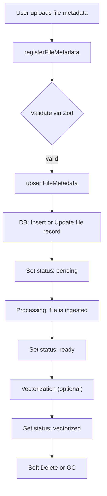
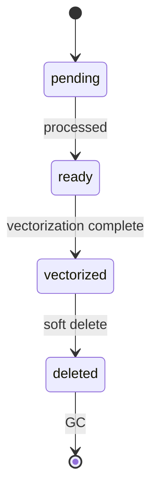

# Ingest Flow Architecture (Refactored v1)

## 1. Overview

The **ingest module** is responsible for managing the lifecycle of files within the system. Its primary roles are:
* **File registration**: Accepting and validating new file metadata from users.
* **Upsert operations**: Creating or updating file records in the database.
* **State transitions**: Managing the status of files as they progress through ingestion, processing, and deletion.

This module ensures that files are correctly tracked, validated, and transitioned between states, supporting reliable downstream processing.

---

## 2. Core Concepts

### Entities
- **`FileType`**: The GraphQL object type representing a file in the API schema.
- **`FileListType`**: A GraphQL type for paginated lists of files.
- **`FileStatusZ`**: Zod enum representing the file's current state (e.g., `pending`, `ready`, `vectorized`, `deleted`).
- **`FileVisibilityZ`**: Zod enum for file visibility (e.g., `public`, `private`).

### Zod + GraphQL Integration
* **Zod** is used to define runtime schemas for validation and type inference.
* **GraphQL** types are derived from Zod schemas, ensuring strong typing and consistency between validation and API contracts.

---

## 3. Workflow



### Step-by-Step Process

#### 1. File Registration (`registerFileMetadata`)
* User submits file metadata via the API.
* The metadata is validated using `FileMetadataRegisterZ`.
* If valid, proceeds to upsert.

#### 2. File Upsert (`upsertFileMetadata`)
* Handles both creation and updating of file records.
* Ensures idempotency: repeated registration of the same file does not create duplicates.
* The file's status is initially set to `pending`.

#### 3. State Transitions
* **`pending`**: File metadata accepted, waiting for further processing (e.g., upload, scanning).
* **`ready`**: File has passed initial checks and is available for use.
* **`vectorized`**: File has been processed for vector search or ML pipelines.
* Transitions are managed explicitly by the ingest service.

#### 4. File Deletion
* **Soft delete**: File status is set to `deleted`, but record remains for potential GC.
* **Garbage Collection (GC)**: Periodic cleanup removes soft-deleted files permanently.

---

## 4. Data Validation Layer

### Zod Schemas
* **`FileMetadataRegisterZ`**: Validates fields required for file registration (e.g., name, type, size).
* **`FileMetadataUpsertZ`**: Used for upsert operations, may allow partial updates.

### DTO Creation
* Uses `createZodDto` to generate Data Transfer Objects (DTOs) from Zod schemas.
* Ensures type-safe inputs and outputs for service and resolver layers.

```ts
import { createZodDto } from 'nestjs-zod';
import { FileMetadataRegisterZ } from './file.zod';

export class FileMetadataRegisterDto extends createZodDto(FileMetadataRegisterZ) {}
```

---

## 5. GraphQL Schema Layer

* **GraphQL types** are defined to closely mirror Zod schemas.
* **`FileType`**: Represents a single file in queries and mutations.
* **`FileListType`**: Used for paginated file queries.
* **`PickType`**: Utility to create GraphQL types with selected fields (e.g., for lightweight lists).
* **Enum registration**: Zod enums (`FileStatusZ`, `FileVisibilityZ`) are registered as GraphQL enums for strong typing.

```ts
@ObjectType()
export class FileType {
  @Field(() => ID)
  id: string;

  @Field()
  name: string;

  @Field(() => FileStatus)
  status: FileStatus;
}
```

---

## 6. Naming Philosophy

* **Behavioral naming**: Used for user-facing actions.
  - `register`: Implies a user-initiated action to add a new file.
* **Technical naming**: Used for internal or DB operations.
  - `upsert`: Indicates an operation that inserts or updates a record as needed.

This distinction keeps the API intuitive for users, while the implementation remains precise and maintainable.

---

## 7. Next Steps (Phase 2)

Planned improvements for the next refactoring phase:

1. **Service Layer Cleanup**
   - Refactor business logic for clarity and testability.
2. **Repository Typing**
   - Add type safety to repository/database access layers.
3. **Integration Tests**
   - Implement comprehensive tests for ingest workflows.
4. **Documentation Exports**
   - Auto-generate API and schema docs from Zod and GraphQL definitions.

---

## Appendix: Example State Transition

