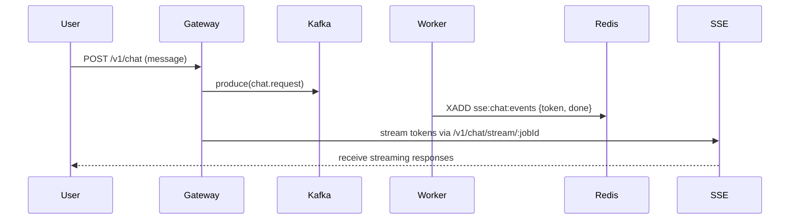

# 💬 Chat Module Overview

> Implements the conversational interface and real-time streaming layer between Gateway and downstream LLM workers.

---

## Overview

The **Chat Module** provides end-to-end infrastructure for chat sessions, messages, and streaming inference results:

- Handles **message enqueueing**, **session lifecycle**, and **real-time token streaming** via SSE.
- Integrates with **Kafka** for background LLM worker execution.
- Stores conversations in **PostgreSQL** with ownership enforcement and RAG safety.
- Uses **Redis Streams** for real-time pub/sub bridging and outbox reliability.

---

## Key Components

| Component | Description |
|------------|-------------|
| `ChatController` | REST + SSE interface for chat jobs and token streams. Uses `JwtAuthGuard` and Zod validation. |
| `ChatService` | Core orchestration layer. Handles enqueue logic, Kafka publishing, Redis stream reading, and session creation. |
| `ChatRepository` | Low-level data access using raw SQL and Zod validation. Manages sessions, messages, jobs, and outbox. |
| `ChatResolver` | GraphQL resolver for querying chat history and messages (with cursor-based pagination). |
| `ChatSessionResolver` | Handles session lists, deletion, and GraphQL subscriptions for session events. |
| `SessionEventsStreamBridge` | Background bridge translating Redis Stream events into GraphQL PubSub. |

---

## Features

- **Kafka-backed job pipeline** for chat requests
- **Redis Stream → SSE bridge** for real-time model output
- **Soft delete flow** aligned with File and Session deletion policies
- **Cursor pagination** for efficient history queries
- **Ownership & Auth Guards** ensuring user isolation
- **Zod schemas** across API boundaries for type safety

---

## Example Workflow

---

## Next Steps

- [ ] Introduce retry/backpressure strategy for Redis Streams
- [ ] Add metrics for token throughput and latency
- [ ] Extend session deletion propagation to cleanup Redis keys
- [ ] Evaluate WebSocket fallback for long-lived streams