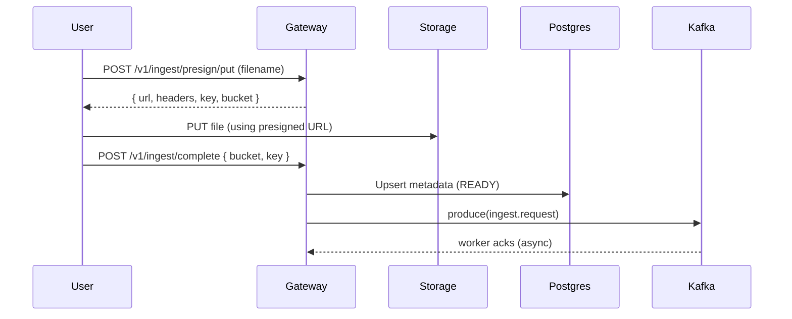

# 📥 Ingest Module Overview

> Manages the end‑to‑end lifecycle of user files: registration (PENDING), upload completion (READY), listing, and deletion—with strong ownership guarantees and background processing hooks.

---

## Overview

The **Ingest Module** provides a clean boundary for file management in the Gateway:

- Issues **presigned PUT URLs** for direct upload to object storage.
- Tracks file state in **PostgreSQL** (`PENDING → READY → DELETING → DELETED`).
- Publishes **Kafka** events to drive downstream processing (e.g., vectorization, indexing).
- Exposes GraphQL queries/mutations (list, register, delete) and **subscriptions** for status changes.

---

## Key Components

| Component | Description |
|---|---|
| `IngestController` | REST endpoints for presign + completion + head proxy. Protected by `JwtAuthGuard`. |
| `IngestResolver` | GraphQL API for listing, registering, deleting files and subscribing to status changes. |
| `IngestService` | Orchestrates DB upserts and worker events. Normalizes statuses and emits Kafka messages. |
| `IngestRepository` | Raw SQL data access (Zod‑validated). Handles keyset pagination and ownership checks. |

---

## Features

- **Direct‑to‑storage uploads** with presigned URLs
- **Soft delete** flow aligned with session/file deletion policies
- **Keyset pagination** for large file lists
- **Status subscriptions** (upload → vectorize → delete)
- **Zod schemas** at boundaries for type safety

---

## Example Workflow

---

## GraphQL Surface (high‑level)

- `files(first, after)` — list my files (keyset pagination)
- `registerFile(input)` — create PENDING record before upload
- `deleteFile(fileId)` — soft delete + enqueue worker cleanup
- `fileStatusChanged(fileId)` — subscription for status updates

---

## Next Steps

- [ ] Emit per‑stage metrics (upload latency, vectorization time)
- [ ] Add Redis cache for HEAD metadata / presign rate‑limits
- [ ] Extend deletion flow to purge storage prefixes & embeddings
- [ ] Document failure/rollback paths (outbox, DLQ, retries)