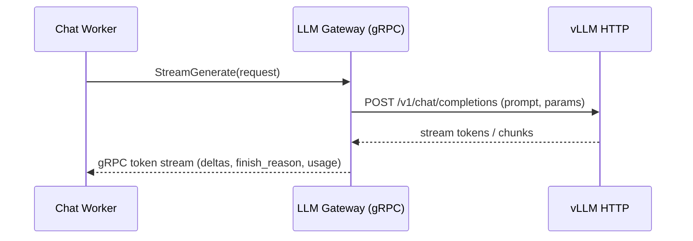

# 🚀 LLM Gateway Overview

> A thin, high‑throughput gRPC gateway in Go that fronts vLLM and exposes a streaming LLM API for workers (e.g., Chat Worker).

---

## Overview

The **LLM Gateway** is a standalone Go service that sits between internal callers (Python workers, future services) and a **vLLM** deployment:

- Exposes a **gRPC API** optimized for streaming tokens and low latency.
- Forwards requests to **vLLM HTTP APIs** with configurable timeouts and model defaults.
- Normalizes responses into a simple, worker‑friendly protocol (tokens, finish reasons, usage).
- Acts as a central place to configure **models, timeouts, and future policies** (rate limits, tracing, etc.).

Modern LLM pipelines often require a stable, low-latency interface decoupled from the underlying model backend.  
The LLM Gateway abstracts this boundary, ensuring workers do not depend on any single model provider or HTTP schema.

This allows Python workers (like `chat_worker`) to call a single gRPC endpoint instead of dealing directly with vLLM’s HTTP/JSON details.

---

## Key Components

Located under `apps/llm-gateway`:

| Component                 | Description                                                                                                  |
| ------------------------- | ------------------------------------------------------------------------------------------------------------ |
| `cmd/llm-gateway/main.go` | Service entrypoint. Loads config, initializes logger, wires vLLM client + gRPC server, and starts listening. |
| `internal/config`         | Configuration loading (port, vLLM base URL, default model, timeouts, etc.). Typically sourced from env vars. |
| `internal/logger`         | Structured logging setup using `zap`, used across the service for consistent logs.                           |
| `internal/vllm`           | HTTP client for vLLM; handles request/response mapping, timeouts, and error normalization.                   |
| `internal/service`        | gRPC service implementation (LLM API). Bridges between protobuf contracts and the `vllm` client.             |
| `proto/`                  | Protobuf definitions and generated Go code for the LLM service (request/response messages, RPC interface).   |

---

## gRPC API (High‑Level)

> Exact message fields are defined in `apps/llm-gateway/proto`, but this summarizes the intent.

The gateway exposes a gRPC service (e.g., `LLMService`) with streaming support:

- **`ChatCompletion`** (unary)
- **`ChatCompletionStream`** (server-streaming)

Typical usage from a worker:

1. Build a prompt or chat message list (e.g., from LangChain or custom pipeline).
2. Call `StreamGenerate` with the prompt and options.
3. Consume the response stream and forward tokens to Redis Streams / SSE.

The gateway hides vLLM‑specific details (e.g., REST paths, JSON schema) and presents a stable, versioned protobuf contract.

---

## Data Flow



In the broader system:

- **Chat Worker** uses the gateway as its primary LLM provider (`LLM_PRIMARY_PROVIDER=vllm`).
- The worker then streams those tokens into **Redis Streams**, which the Gateway (NestJS) exposes via **SSE** to the Web client.

---

## Configuration

### Gateway Settings

Configuration is loaded by `internal/config` and typically controlled via environment variables (see code for exact names):

- **Service**
  - `PORT` – gRPC listen port (e.g., `50052`).
  - `LOG_LEVEL` – log level for `zap` (e.g., `info`, `debug`).
- **vLLM**
  - `VLLM_URL` – base URL for the vLLM HTTP server (e.g., `http://localhost:8000`).
  - `TIMEOUT_MS` – request timeout to vLLM in milliseconds.
  - `DEFAULT_MODEL` – default model name used when callers don’t specify one.

### Worker Settings

Workers refer to the gateway via settings such as:

- `LLM_GATEWAY_ADDR`
- `LLM_DEFAULT_MODEL`
- `LLM_PROVIDER`

---

## Error Handling & Timeouts

The gateway centralizes error handling for LLM calls:

- Applies a **per‑request timeout** (based on `TIMEOUT_MS`) to vLLM calls.
- Maps vLLM HTTP/network errors into structured gRPC errors / status codes.
- Ensures that workers receive a clear **finish state** (error vs. completed) even when vLLM fails.

All HTTP, JSON, timeout, and streaming edge cases are normalized into typed gRPC errors, making worker behavior deterministic.

This design keeps worker code simpler: they consume a single gRPC stream and don’t need to handle HTTP edge cases directly.

---

## Observability

The gateway uses structured logging via `zap`:

- Logs include key fields such as `model`, `timeout_ms`, `vllm_url`, and per‑request status where applicable.
- Logs are suitable for aggregation in a centralized logging stack (e.g., Loki, ELK, etc.).

Future enhancements can extend this with:

- gRPC interceptors for **tracing** (e.g., OpenTelemetry).
- Request/response metrics (latency, token counts, error rate) exported to **Prometheus**.

All streaming responses include token counts and per-request latency measured at the gateway.

---

## Local Development

From the repo root:

```bash
make llm-gateway
```

This will:

- Build and run the gRPC server defined in `cmd/llm-gateway/main.go`.
- Use configuration from environment variables (or defaults) for port, vLLM URL, and timeouts.

Ensure you have a running vLLM instance reachable at `VLLM_URL` before sending traffic from workers.

---

## Next Steps

- [ ] Add authentication / API keys for internal callers (planned)
- [ ] Expose Prometheus metrics (per‑model latency, errors, token throughput)
- [ ] Add configurable rate limiting and concurrency controls
- [x] Support multiple backends (vLLM + OpenAI) behind a unified gRPC API
- [ ] Tighten integration with tracing (OpenTelemetry spans per LLM request)
