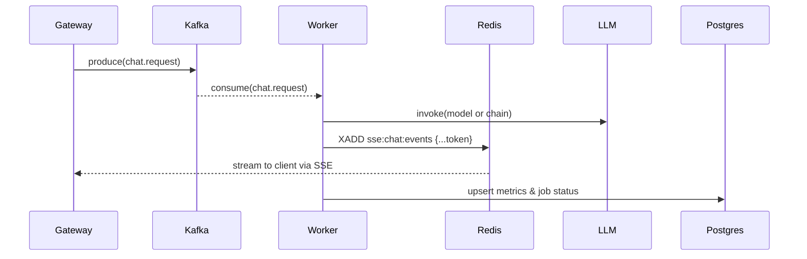

# 💬 Chat Worker Overview

> Consumes `chat.request` jobs, executes LLM or RAG pipelines, and streams real‑time responses back through Redis Streams for the Gateway to relay via SSE.

---

## Overview

The **Chat Worker** handles conversational inference for both standard chat (GEN) and retrieval‑augmented generation (RAG) modes:

- Consumes messages from **Kafka** topic `chat.request`.
- Builds context from **recent chat history** and optional RAG retrievals.
- Runs **LLM inference** (LangChain or direct) with streaming token callbacks.
- Publishes live token events to **Redis Streams** (SSE‑friendly).
- Persists metrics, usage, and status into **Postgres** for observability.

---

## Key Components

| Component | Description |
|------------|-------------|
| `main.py` | Entrypoint — Kafka consumer, LLM orchestration, RAG/GEN branching, and graceful shutdown. |
| `application/llm_runner.py` | Unified runner for LangChain LLM or chain execution with streaming callbacks and timeouts. |
| `application/utils/message_builder.py` | Builds context‑window messages (system + history + user) within token limits. |
| `infrastructure/langchain/token_stream_callback.py` | Forwards streamed tokens to Redis; accumulates final text. |
| `infrastructure/langchain/metrics_callback.py` | Collects latency, token counts, and error metrics per job. |
| `infrastructure/stream/stream_service.py` | Publishes job events (`token`, `final`, `done`, etc.) to Redis Streams. |
| `domain/ports/history.py` | Protocol defining how chat history is loaded and appended. |
| `domain/ports/metrics_repo.py` | Persistence contract for LLM run metrics. |

---

## Features

- **Dual mode:** standard chat (GEN) and RAG pipeline
- **Token streaming:** real‑time output via Redis Streams → SSE
- **Cancellation & timeout** support per job
- **Ownership enforcement** via userId/jobId scoping
- **Metrics persistence:** latency, tokens, errors, and status
- **Graceful shutdown:** SIGINT/SIGTERM aware

---

## Data Flow

---

## Observability

- **Metrics tables**: `llm_jobs`, `llm_messages`
- **Tracked fields**: `prompt_tokens`, `completion_tokens`, `latency_ms`, `status`, `error`
- **Logs** include: `trace_id`, `job_id`, `user_id`, `session_id`

---

## Next Steps

- [ ] Add retry/backoff logic for transient LLM failures
- [ ] Stream intermediate tool calls (RAG steps) via Redis
- [ ] Implement partial‑completion recovery for canceled jobs
- [ ] Extend metrics with cost and provider telemetry
- [ ] Improve RAG search quality via re‑ranking, hybrid (BM25 + vector) scoring, and embedding freshness tracking