# 🧩 Index Worker Overview

> Consumes ingest events, extracts & chunks text, embeds content, and upserts vectors into the store—closing the loop for RAG-ready documents.

---

## Overview

The **Index Worker** turns raw uploads into searchable vectors:

- Listens to **Kafka** topics (`ingest.request`, `ingest.delete`).
- Extracts text (PDF/TXT/MD), **cleans**, and **chunks** it (word/char/token modes).
- Generates embeddings and **upserts** them into the vector store.
- Updates **PostgreSQL** metadata and emits progress/status events.
- Supports **idempotent** re-processing via deterministic IDs.

---

## Key Components

| Component | Description |
|---|---|
| `main.py` | Entrypoint: Kafka consumer loop, graceful shutdown, dispatch to flows. |
| `application/extract_text.py` | File-type detection, text extraction, and normalization. |
| `application/chunking.py` | RAG-friendly chunking with overlap and deterministic chunk IDs. |
| `domain/embedder.py` | Embedding provider abstraction (e.g., OpenAI/Local). |
| `infra/vector_store.py` | Vector DB client (e.g., Weaviate/PGVecto/FAISS) with upsert/delete. |
| `infra/repository.py` | Postgres metadata updates (status, sizes, timestamps). |

---

## Features

- **Deterministic chunk IDs** for safe retries
- **Token/word/char** chunking modes with overlap
- **Backpressure-friendly** Kafka consumption
- **Graceful shutdown** (SIGINT/SIGTERM)
- **Zod/Pydantic** validation at boundaries

---

## Data Flow

```mermaid
sequenceDiagram
  participant Gateway
  participant Kafka
  participant Worker
  participant Storage
  participant Vector as VectorStore
  participant DB as Postgres

  Gateway->>Kafka: produce(ingest.request)
  Kafka-->>Worker: consume(ingest.request)
  Worker->>Storage: download object bytes
  Worker->>Worker: extract → clean → chunk
  Worker->>Worker: embed chunks (batched)
  Worker->>Vector: upsert vectors
  Worker->>DB: update file status (READY/INDEXED)
```

---

## Topics & Streams

- **Kafka (consume)**
  - `ingest.request` — start indexing a file
  - `ingest.delete` — purge vectors & metadata
- **Redis (publish, optional)**
  - `sse:ingest:events:*` — progress events for UI (token counts, stages, errors)

---

## Failure Handling & Idempotency

- Parse/validate messages; **skip-not-crash** on malformed input.
- Deterministic **chunk IDs** prevent duplicate upserts on retry.
- Repository writes are retried with exponential backoff (configurable).
- Deletion flow treats missing vectors as **idempotent success**.

---

## Observability

- Metrics: `index_jobs_total{result}`, `chunks_total`, `embed_tokens_total`, `vector_upsert_ms`.
- Logs include `trace_id`, `file_id`, `job_id` for cross-system correlation.

---

## Configuration (high-level)

- `INDEX_KAFKA_BROKERS`, `INDEX_CONSUMER_GROUP`
- `EMBEDDER_PROVIDER`, `EMBEDDER_MODEL`
- `CHUNK_MODE`, `CHUNK_SIZE`, `CHUNK_OVERLAP`
- `VECTOR_STORE_URL`, `VECTOR_INDEX_NAME`

---

## Next Steps

- [ ] Batch upserts with backoff & jitter for large files
- [ ] Add partial re-index (page-ranges/diffs) support
- [ ] Emit per-stage metrics and progress events to Redis Streams
- [ ] Pluggable dedup (content-hash) to skip near-duplicates